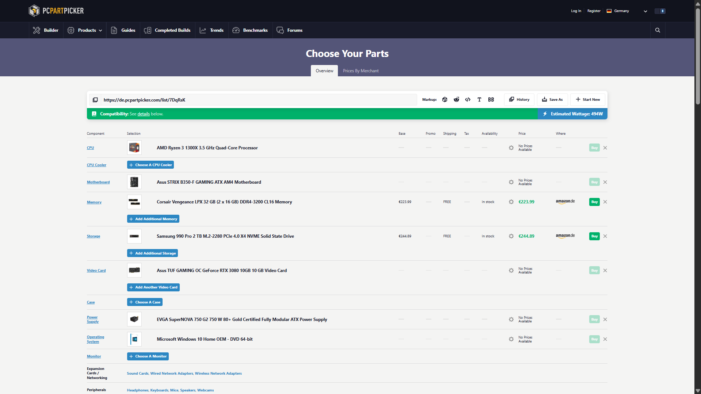

# Lesson 01: Hardware-Grundlagen
## IT-Systemintegration Portfolio

### 1. Komponenten eines Computers:
* **Mainboard:** Die Zentrale des Computers, die alle Komponenten verbindet.
* **Prozessor (CPU):** Das Gehirn des Computers, das Berechnungen durchführt.
* **Arbeitsspeicher (RAM):** Ein flüchtiger Speicher für schnelle Datenverarbeitung.
* **Festplatte (SSD/HDD):** Speichert Daten dauerhaft.
* **Netzteil (PSU):** Versorgt den Computer mit Strom.

### 2. Praktische Übung:
Ich habe eine PC-Konfiguration bei PCPartPicker erstellt, um die Kompatibilität der Hardware zu verstehen.
