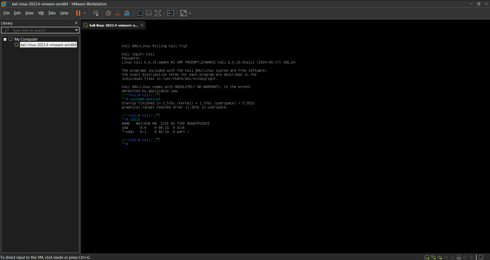

# Lab Report: BIOS/UEFI & Boot Process

## 🎯 Task: Configure Boot Priority
The goal was to access the BIOS and change the boot order to prioritize removable media (CD-ROM).

## 🛠 Actions:
1. Entered the **PhoenixBIOS Setup Utility** in VMware.
2. Navigated to the **Boot** tab.
3. Used `+` key to move **CD-ROM Drive** to the top of the list.
4. Saved changes with **F10**.

## ✅ Result:
The system now looks for bootable media in the CD-ROM drive before attempting to boot from the local hard drive.

---

## 🎯 Task 2: Boot Analysis & Troubleshooting
- **Issue:** The Kali Linux graphical interface failed to load (Login Loop).
- **Troubleshooting:** Switched to **TTY3** via `Ctrl+Alt+F3` to access the system console.
- **Diagnostics:** Ran specialized commands to analyze the boot performance:
  - `systemd-analyze`: Total boot time was **3.952s** (Kernel: 2.576s + Userspace: 1.376s).
  - `lsblk`: Verified that the main partition `sda1` (80.1G) is correctly mounted.

## 💡 Final Decision
To ensure a stable learning environment for the upcoming lessons, I am transitioning to **Ubuntu 24.04.3 LTS**.
