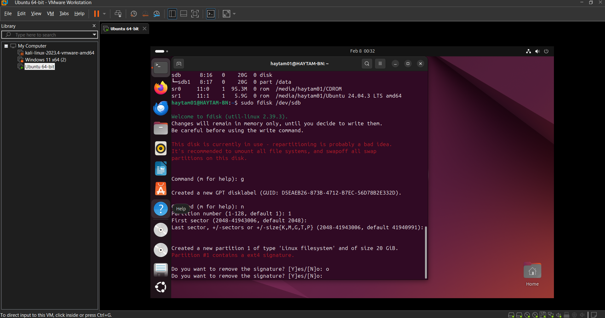
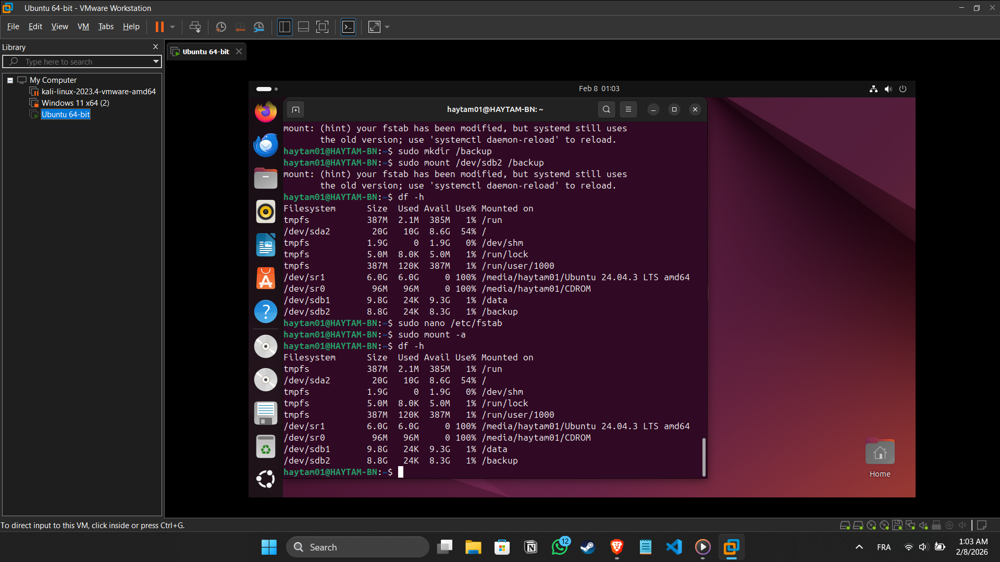

# 🛠️ Troubleshooting & Professional Lessons Learned

During the execution of **Storage Lesson 03**, I encountered a real-world system administration challenge. This document details the technical problem, the analytical process, and the successful resolution.

---

## 🛑 The Challenge: "Device or Resource Busy"

### 1. The Scenario
After successfully mounting the first partition to `/data`, I attempted to modify the partition table of `/dev/sdb` using `fdisk` to create a second partition for backups.

### 2. The Problem (The Red Warning)
The system issued a critical warning preventing any changes to the disk structure.

 
*(Note: As seen in the screenshot, the disk was "busy" because it was already active in the system)*

### 3. The Analysis
The Linux kernel protects mounted file systems from partition table changes to prevent data corruption. Because I had already mounted `/dev/sdb1` to `/data`, the disk was "locked" for safety.

### 4. The Resolution Strategy
Instead of ignoring the warning, I followed standard industry safety protocols:
1. **Unmounting:** Executed `sudo umount /data` to release the lock on the disk.
2. **Re-partitioning:** Successfully re-entered `fdisk`, deleted the old layout, and created two new 10GB partitions (`sdb1` and `sdb2`).

*(Note: Final verification showing both /data and /backup partitions working perfectly)*

---

## 🧠 Key Technical Takeaways

| Lesson | Action for Future Projects |
| :--- | :--- |
| **Disk Locking** | Never modify a partition table while partitions are mounted. |
| **Safety First** | Use `sudo mount -a` to verify `/etc/fstab` syntax before rebooting. |
| **Precision** | Using `+10G` in `fdisk` is more reliable than manual sector calculation. |

---

## 📈 Professional Growth
This challenge was a vital learning moment. It proved that a **Systemintegrator** must not only know commands but must also understand **system state** and **data safety protocols**.
