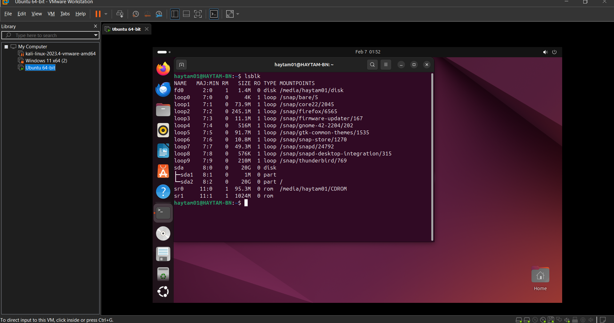
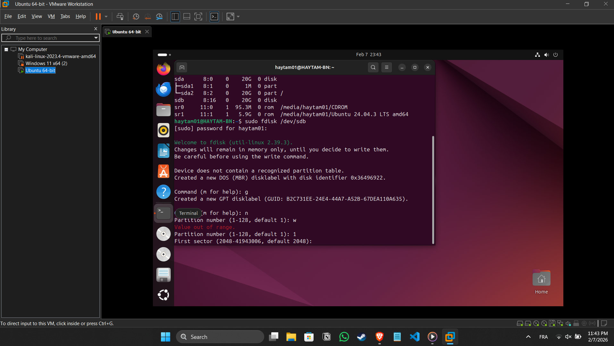
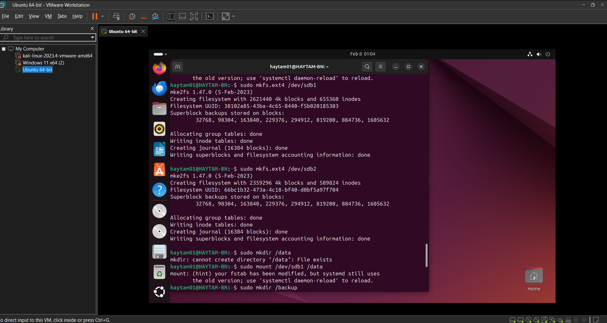
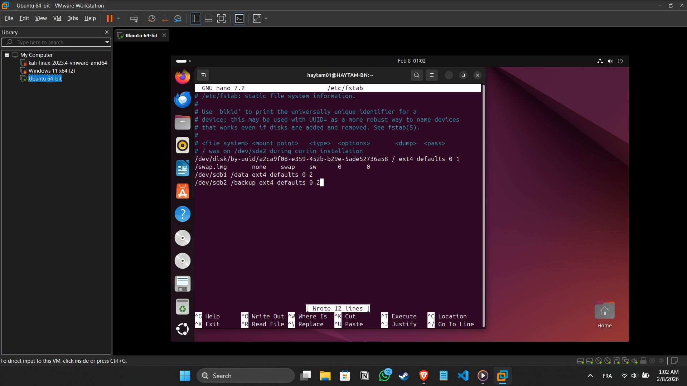

# 📋 Technical Project Report: Storage Management

## 1. Introduction
This report documents the practical implementation of adding, partitioning, and mounting a new hard disk in a Linux environment.

## 2. Project Steps

### Phase 1: Disk Identification
* Connected a 20GB virtual hard drive via VMware.
* Used the `lsblk` command to identify the device name, which was recognized as `/dev/sdb`.

### Phase 2: Partitioning (The Memory Challenge)
* Initialized the disk with a **GPT** partition table using the `fdisk` utility.
* Created two primary partitions to separate data from backups:
    * **Partition 1 (`/dev/sdb1`):** 10GB for general data.
    * **Partition 2 (`/dev/sdb2`):** 10GB for backup storage.

### Phase 3: Filesystem Creation & Mounting
* Formatted both partitions using the **ext4** journaling filesystem.
* Created mount points and linked them to the system hierarchy.

### Phase 4: Automation (Persistence)
* Modified the `/etc/fstab` file to ensure the partitions are automatically mounted after a system reboot.

## 3. Results & Verification
* Verified the configuration using `sudo mount -a` and `df -h`.
* Successfully managed two distinct storage areas on a single physical disk.

